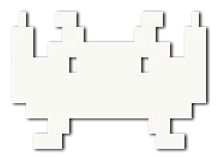

<div align="center">
    
</div>

<h2 align="center">MAME Data Manager</h2>

<p align="center">Download, read, manage and export MAME information</p>

<p align="center">
    
    
</p>

<p align="center">
  <a href="#about">About</a> •
  <a href="#why">Why</a> •
  <a href="#running-the-application">Running the Application</a> •
  <a href="#how-to-use">How to Use</a> •
  <a href="#documentation">Documentation</a> •
  <a href="#credits">Credits</a> •
  <a href="#contribute">Contribute</a> •
  <a href="#license">License</a>
</p>

## About

MAME Data Manager is a tool designed to help manage and manipulate data related to MAME (Multiple Arcade Machine Emulator). It allows users to efficiently handle large datasets, extract relevant information, and generate useful reports or export data in various formats.

## Why

Managing MAME information can be challenging as the data is scattered across various files, each with its own format and structure. This fragmentation makes it difficult for users to work with the data effectively. MAME Data Manager aims to solve this problem by providing a tool that automatically downloads the latest versions of these files and consolidates all the information into a single, unified database. This allows users to access and manipulate MAME data more easily and efficiently.

## Running the application

MAME Data Manager is a Rust-based application. Below are the instructions for running the application by either downloading the binary or running it locally from the source code.

### Option 1: Download the Binary

1. **Download the Binary**:

   - Visit the [releases section](https://github.com/retro-arcade-games/mame-data-manager/releases) in this repository.
   - Download the latest version of the binary. (Currently only for macOS).

2. **Run the Application**:
   - Navigate to the folder where you downloaded the binary.
   - On macOS:
     - Ensure the file has execution permissions and then run it:
       ```sh
       chmod +x mame-data-manager
       ./mame-data-manager
       ```

### Option 2: Clone the Repository and Run Locally

1. **Clone the Repository**:

   - Open your terminal and clone this repository using Git:
     ```sh
     git clone https://github.com/retro-arcade-games/mame-data-manager.git
     cd mame-data-manager
     ```

2. **Build the Project**:

   - Make sure you have Rust installed on your system. If not, you can install it by following the instructions at [rust-lang.org](https://www.rust-lang.org/).
   - Build the project by running:
     ```sh
     cargo build --release
     ```

3. **Run the Application**:
   - After building, the binary will be available in the `target/release/` directory.
   - Run the application from that location:
     ```sh
     ./target/release/mame-data-manager
     ```

## How to Use

Once the application is running, an interactive menu will appear in the terminal. Use the arrow keys to navigate through the menu and select the desired options.

- **Input data**  
  Options for managing and processing input data:

  - **Download files**: Downloads the necessary files from the internet. This step is crucial as the application relies on these files to generate the final outputs.
  - **Extract files**: Extracts the contents of the downloaded files, preparing them for further processing. The files are compressed archives that need to be unpacked.
  - **Read files**: Reads and processes the extracted files which will be stored in memory and used in subsequent steps.

- **Filter data**  
  Options for filtering the machines based on various criteria:

  - **Remove machines with non-game categories**: Filters out machines that do not belong to game-related categories (e.g., Calculator, Handheld, or Watch).
  - **Remove device machines**: Excludes machines classified as devices, which are non-playable components used by other machines.
  - **Remove BIOS machines**: Filters out machines that are BIOS systems, which are often necessary but not directly playable.
  - **Remove mechanical machines**: Excludes machines that are classified as mechanical, such as pinball or slot machines, that do not fit the target data set.
  - **Remove modified machines**: Filters out machines that are flagged as modified or unofficial versions of original systems such as bootlegs, prototypes or PlayChoice-10.
  - **Remove clones**: Excludes clone machines that are duplicates or slight variations of original systems.
  - **Remove ALL non-game machines (apply all machine filters)**: Applies all the above filters to remove all non-game related machines in one step.

- **View statistics**  
  Options to view various statistics and insights based on the processed data:

  - **General stats**: Displays an overview of the total number of machines, filtered machines, and other general statistics.
  - **Top 10 categories**: Shows the top 10 categories with the highest number of machines.
  - **Top 10 subcategories**: Displays the top 10 subcategories by machine count.
  - **Top 10 manufacturers**: Lists the top 10 manufacturers based on the number of machines they produced.
  - **Top 10 series**: Shows the top 10 game series with the most entries in the data set.
  - **Top 10 languages**: Displays the top 10 languages used across the machines.
  - **Top 10 players information**: Shows data on player configurations, such as single-player, multiplayer, and their frequency.

- **Export data**  
  Options to export the processed data in various formats:
  - **Export to SQLite**: Exports the filtered data into a SQLite database for easy querying and analysis.
  - **Export to JSON**: Saves the data in JSON format, which is ideal for use in web applications or other systems that consume structured data.
  - **Export to CSV**: Outputs the data in CSV format, which is easily viewable and editable in spreadsheet applications like Excel or Google Sheets.

Simply follow the on-screen instructions to perform the desired actions.

## Documentation

More detailed documentation about the project can be found [here](./docs/README.md)

## Credits

MAME Data Manager wouldn't be possible without the invaluable contributions and resources provided by the following individuals and communities:

- **The MAME Community**: A special thanks to the entire MAME community for their continuous efforts in preserving arcade history and making it accessible to everyone. Your work is the foundation upon which this project is built.

- **AntoPISA and Progetto-SNAPS**: [AntoPISA](https://github.com/AntoPISA)'s [Progetto-SNAPS](https://www.progettosnaps.net) project has been an essential resource for MAME artwork and other assets. Thank you for your dedication and hard work in creating and maintaining this incredible resource.

- **Motoschifo and Arcade Database (ADB)**: Motoschifo's [Arcade Database](http://adb.arcadeitalia.net) is a comprehensive resource for MAME data, providing detailed information about arcade games and machines.

- **Arcade-History**: The team behind [Arcade-History](https://www.arcade-history.com) has done an amazing job in documenting the history of arcade games.

- **NPlayers Team**: The [NPlayers](https://nplayers.arcadebelgium.be) project by Arcade Belgium is a fantastic resource for information on multiplayer arcade games.

- **[zombiesbyte](https://github.com/zombiesbyte) and XMLTractor**: Special thanks to zombiesbyte for [XMLTractor](https://github.com/zombiesbyte/xmltractor) project.

## Contribute

Contributions are welcome! If you'd like to contribute, please fork the repository, create a new branch, and submit a pull request. Make sure to follow the project's coding guidelines and include tests where applicable.

## License

This project is licensed under the MIT License - see the [LICENSE](LICENSE) file for details.
