# SQLite Schema

This document describes the database schema used by MAME Data Manager when exporting data to SQLite format.

## Database Diagram

The following diagram shows the relationships between the tables:

```mermaid
erDiagram
    series {
    }
    categories {
    }
    subcategories {
    }
    manufacturers {
    }
    languages {
    }
    players {
    }
    machines {
    }
    machine_languages {
    }
    machine_players {
    }
    extended_data {
    }
    bios_sets {
    }
    roms {
    }
    device_refs {
    }
    softwares {
    }
    samples {
    }
    disks {
    }
    history_sections {
    }
    resources {
    }

    machines ||--|| series : "belongs to"
    machines ||--|| categories : "belongs to"
    machines ||--|| subcategories : "belongs to"
    machines ||--|| manufacturers : "belongs to"
    machines ||--o{ languages : "has many"
    machines ||--o{ players : "has many"
    machines ||--o{ bios_sets : "has many"
    machines ||--o{ roms : "has many"
    machines ||--o{ device_refs : "has many"
    machines ||--o{ softwares : "has many"
    machines ||--o{ samples : "has many"
    machines ||--o{ disks : "has many"
    machines ||--o{ history_sections : "has many"
    machines ||--o{ resources : "has many"
```

## Table Specifications

### `series`

| Attribute | Type         | Description               |
| --------- | ------------ | ------------------------- |
| `id`      | INTEGER, PK  | Primary key of the series |
| `name`    | TEXT, UNIQUE | Unique name of the series |

### `categories`

| Attribute | Type         | Description                 |
| --------- | ------------ | --------------------------- |
| `id`      | INTEGER, PK  | Primary key of the category |
| `name`    | TEXT, UNIQUE | Unique name of the category |

### `subcategories`

| Attribute                   | Type                     | Description                                  |
| --------------------------- | ------------------------ | -------------------------------------------- |
| `id`                        | INTEGER, PK              | Primary key of the subcategory               |
| `name`                      | TEXT                     | Name of the subcategory                      |
| `category_id`               | INTEGER, FK `categories` | Foreign key to `categories` table            |
| `UNIQUE(name, category_id)` | CONSTRAINT               | Ensures unique subcategory name per category |

### `manufacturers`

| Attribute | Type         | Description                     |
| --------- | ------------ | ------------------------------- |
| `id`      | INTEGER, PK  | Primary key of the manufacturer |
| `name`    | TEXT, UNIQUE | Unique name of the manufacturer |

### `languages`

| Attribute | Type         | Description                 |
| --------- | ------------ | --------------------------- |
| `id`      | INTEGER, PK  | Primary key of the language |
| `name`    | TEXT, UNIQUE | Unique name of the language |

### `players`

| Attribute | Type         | Description               |
| --------- | ------------ | ------------------------- |
| `id`      | INTEGER, PK  | Primary key of the player |
| `name`    | TEXT, UNIQUE | Unique name of the player |

### `machines`

| Attribute         | Type                        | Description                              |
| ----------------- | --------------------------- | ---------------------------------------- |
| `id`              | INTEGER, PK                 | Primary key of the machine               |
| `name`            | TEXT, UNIQUE                | Unique name of the machine               |
| `source_file`     | TEXT                        | Source file where the machine is defined |
| `rom_of`          | TEXT                        | Indicates if this is a ROM variant       |
| `clone_of`        | TEXT                        | Indicates if this is a clone             |
| `is_bios`         | INTEGER                     | Boolean flag for BIOS                    |
| `is_device`       | INTEGER                     | Boolean flag for devices                 |
| `runnable`        | INTEGER                     | Boolean flag if machine is runnable      |
| `is_mechanical`   | INTEGER                     | Boolean flag for mechanical devices      |
| `sample_of`       | TEXT                        | Indicates sample reference               |
| `description`     | TEXT                        | Description of the machine               |
| `year`            | TEXT                        | Year of release                          |
| `manufacturer`    | TEXT                        | Manufacturer of the machine              |
| `driver_status`   | TEXT                        | Driver status information                |
| `players`         | TEXT                        | Number of players                        |
| `series`          | TEXT                        | Series name                              |
| `category`        | TEXT                        | Category name                            |
| `subcategory`     | TEXT                        | Subcategory name                         |
| `is_mature`       | INTEGER                     | Boolean flag for mature content          |
| `languages`       | TEXT                        | Languages supported                      |
| `category_id`     | INTEGER, FK `categories`    | Foreign key to `categories` table        |
| `subcategory_id`  | INTEGER, FK `subcategories` | Foreign key to `subcategories` table     |
| `series_id`       | INTEGER, FK `series`        | Foreign key to `series` table            |
| `manufacturer_id` | INTEGER, FK `manufacturers` | Foreign key to `manufacturers` table     |

### `machine_languages`

| Attribute                              | Type                    | Description                      |
| -------------------------------------- | ----------------------- | -------------------------------- |
| `machine_id`                           | INTEGER, FK `machines`  | Foreign key to `machines` table  |
| `language_id`                          | INTEGER, FK `languages` | Foreign key to `languages` table |
| `PRIMARY KEY(machine_id, language_id)` | CONSTRAINT              | Composite primary key            |

### `machine_players`

| Attribute                            | Type                   | Description                     |
| ------------------------------------ | ---------------------- | ------------------------------- |
| `machine_id`                         | INTEGER, FK `machines` | Foreign key to `machines` table |
| `player_id`                          | INTEGER, FK `players`  | Foreign key to `players` table  |
| `PRIMARY KEY(machine_id, player_id)` | CONSTRAINT             | Composite primary key           |

### `extended_data`

| Attribute      | Type                   | Description                              |
| -------------- | ---------------------- | ---------------------------------------- |
| `id`           | INTEGER, PK            | Primary key of the extended data record  |
| `machine_name` | TEXT                   | Name of the machine                      |
| `name`         | TEXT                   | Normalized name                          |
| `manufacturer` | TEXT                   | Normalized manufacturer                  |
| `players`      | TEXT                   | Normalized player information            |
| `is_parent`    | INTEGER                | Boolean flag if this is a parent machine |
| `year`         | TEXT                   | Normalized year                          |
| `machine_id`   | INTEGER, FK `machines` | Foreign key to `machines` table          |

### `bios_sets`

| Attribute      | Type                   | Description                     |
| -------------- | ---------------------- | ------------------------------- |
| `id`           | INTEGER, PK            | Primary key of the BIOS set     |
| `machine_name` | TEXT                   | Name of the machine             |
| `name`         | TEXT                   | BIOS set name                   |
| `description`  | TEXT                   | BIOS set description            |
| `machine_id`   | INTEGER, FK `machines` | Foreign key to `machines` table |

### `roms`

| Attribute      | Type                   | Description                     |
| -------------- | ---------------------- | ------------------------------- |
| `id`           | INTEGER, PK            | Primary key of the ROM          |
| `machine_name` | TEXT                   | Name of the machine             |
| `name`         | TEXT                   | ROM name                        |
| `size`         | INTEGER                | ROM size                        |
| `merge`        | TEXT                   | Merge information               |
| `status`       | TEXT                   | ROM status                      |
| `crc`          | TEXT                   | CRC checksum                    |
| `sha1`         | TEXT                   | SHA-1 checksum                  |
| `machine_id`   | INTEGER, FK `machines` | Foreign key to `machines` table |

### `device_refs`

| Attribute      | Type                   | Description                         |
| -------------- | ---------------------- | ----------------------------------- |
| `id`           | INTEGER, PK            | Primary key of the device reference |
| `machine_name` | TEXT                   | Name of the machine                 |
| `name`         | TEXT                   | Device reference name               |
| `machine_id`   | INTEGER, FK `machines` | Foreign key to `machines` table     |

### `softwares`

| Attribute      | Type                   | Description                     |
| -------------- | ---------------------- | ------------------------------- |
| `id`           | INTEGER, PK            | Primary key of the software     |
| `machine_name` | TEXT                   | Name of the machine             |
| `name`         | TEXT                   | Software name                   |
| `machine_id`   | INTEGER, FK `machines` | Foreign key to `machines` table |

### `samples`

| Attribute      | Type                   | Description                     |
| -------------- | ---------------------- | ------------------------------- |
| `id`           | INTEGER, PK            | Primary key of the sample       |
| `machine_name` | TEXT                   | Name of the machine             |
| `name`         | TEXT                   | Sample name                     |
| `machine_id`   | INTEGER, FK `machines` | Foreign key to `machines` table |

### `disks`

| Attribute      | Type                   | Description                     |
| -------------- | ---------------------- | ------------------------------- |
| `id`           | INTEGER, PK            | Primary key of the disk         |
| `machine_name` | TEXT                   | Name of the machine             |
| `name`         | TEXT                   | Disk name                       |
| `sha1`         | TEXT                   | SHA-1 checksum                  |
| `merge`        | TEXT                   | Merge information               |
| `status`       | TEXT                   | Disk status                     |
| `region`       | TEXT                   | Disk region                     |
| `machine_id`   | INTEGER, FK `machines` | Foreign key to `machines` table |

### `history_sections`

| Attribute      | Type                   | Description                        |
| -------------- | ---------------------- | ---------------------------------- |
| `id`           | INTEGER, PK            | Primary key of the history section |
| `machine_name` | TEXT                   | Name of the machine                |
| `name`         | TEXT                   | History section name               |
| `text`         | TEXT                   | History section text               |
| `order`        | INTEGER                | Display order                      |
| `machine_id`   | INTEGER, FK `machines` | Foreign key to `machines` table    |

### `resources`

| Attribute      | Type                   | Description                     |
| -------------- | ---------------------- | ------------------------------- |
| `id`           | INTEGER, PK            | Primary key of the resource     |
| `machine_name` | TEXT                   | Name of the machine             |
| `type`         | TEXT                   | Resource type                   |
| `name`         | TEXT                   | Resource name                   |
| `size`         | INTEGER                | Resource size                   |
| `crc`          | TEXT                   | CRC checksum                    |
| `sha1`         | TEXT                   | SHA-1 checksum                  |
| `machine_id`   | INTEGER, FK `machines` | Foreign key to `machines` table |
